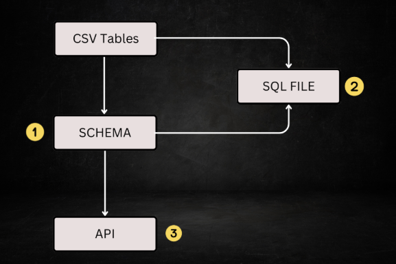

### About

- This project generates a single `.sql` file (PostgreSQL database) for the provided `.csv` files in `./data` directory.
- It also generates a basic standalone CRUD API for these tables.
- I aim to add more features to this application as well as the generated application.
- Please read this doc thoroughly to understand how it works.



#### Step 1: Schema Generation

```bash
go build . && ./CSV_App schema
```

- This generates an initial schema in `data/schema.json` by analyzing the CSV files `./data` directory

- In this step, all the tables, columns and datatypes are identified. Also, special constraints can also be set (read ahead to understand).

- Always successful unless:

  - an error is encountered while parsing `.csv` files
  - duplicate table name or column name name is found
  - empty table name or column name is found

- No data validation is performed

- Constraints in `data/schema.json` should be reviewed

- Special constraints like `Min`, `Max`, `Enums` & `Default` are always required to be set manually

- Checkout the sample schema file [here](./data/test.json)

- Table Names & Column Names should NOT be changed as they are **_sanitized_**

  > [!NOTE]
  > Leading & Trailing spaces are trimmed in sanitization.
  > Any sequence of non-alphanumeric character is replaced by a single underscore.
  > E.g. `!'Table Name'!` is transformed into `_Table_Name_`

#### Step 2: SQL File Generation

```bash
go build . && ./CSV_App sql
```

- This generates the SQL file in `data/db.sql` for the given CSV files
- CSV Data is validated against the constraints provided in `schema.json`
- Checkout the sample SQL file [here](./data/db.sql)

#### Step 3: Execute SQL file

Run following commands to create database and execute the `db.sql` file

```bash
psql -h localhost -U postgres -c 'CREATE DATABASE "DB_Name"'
psql -h localhost -U postgres -d "DB_Name" -f data/db.sql
```

#### Step 4: Create Application

```bash
go build . && ./CSV_App app
```

- This generates a standalone app in `./app` directory
- Checkout the sample app here [here](./app/)

### Data Types

- integer
- float
- boolean
- text
- date
- time
- datetime (with timezone)
- array of these primitive types

> [!NOTE]
> Checkout [TypeTest.csv](./data/TypeTest.csv) to understand data formats in CSV files.
> If a column doesn't have any value, it's datatype is marked as empty in `schema.json` and it should be set manually.

### Column Constraints

#### Special Constraint Codes:

| Code | Constraint  |
| ---- | ----------- |
| N    | Not Null    |
| U    | Unique      |
| P    | Primary Key |
| F    | Foreign Key |

#### Notes:

- The constraints should be mentioned before the column name
- Constraint code & column name should be separated by a colon (:)
- Presence of 'P' overrides all the other constraints, P also sets the Not Null & Unique
- Extra unwanted characters in constraints are ignored
- Eg: `P:columnName`, `U:columnName`, `NU:columnName`, `FN:columnName`, `FNU:columnName`

> [!NOTE]
> If a colon is present in a column label, the left part will be treated as constraint

#### Primary Key

- Composite Primary Keys are not allowed
- If no primary key is provided, a column named `__ID` is added by default in SQL file and the generated app but `schema.json`remains unmodified
- All datatypes are allowed to be primary key

#### Foreign Key Mapping

If a column is marked as a foreign key, the referenced column is mapped with the following idea:

- if any other table has a column with the same name and datatype, it is marked as referenced column
- if multiple such columns exist, any one is choosen
- if no match is found, the `ForeignTable` & `ForeignColumn` fields are left with value `__`

#### Min & Max

- Should always be mentioned in strings
- Should be empty for boolean values or if they aren't required

- Data is validated by value for integer, float, date, time, datetime
- E.g. `Min:"3"` and `Max:"10"` for `integer` mean `3 >= value <= 10`

- Data is validated by length for strings (should be a +ve integer)
- E.g. `Min:"3"` and `Max:"10"` for `text` mean `3 >= length(value) <= 10`

- For array: "array_length,individual_value_constraint"
- E.g. `Min: "2,3"` and `Max: "5,10"` for `integer[]` implies `2 >= len(arr) <= 5` and `3 >= each_element <= 10`
- E.g. `Min: "2,3"` and `Max: "4,10"` for `text[]` implies `2 >= len(arr) <= 4` and `3 >= length(each_element) <= 10`

#### Enums

- Enums should be an array that specifies the allowed values for the column
- Each indiviual value in Enums should satisfy the individual `Min` and `Max` constraints
- For array columns, each values_arr[i] should be present in enums array

#### Default

- Default value should satisy the min, max and enums constraint if they're present
- Primary Key & Unique columns shouldn't have a default value

### CRUD App

- It is a standalone app, it runs on its own.

- Remember to modify the .env variable values before building or starting the app.

- Each API response has following structure in JSON format:

  | Field   | Description                                               |
  | ------- | --------------------------------------------------------- |
  | success | boolean flag                                              |
  | message | string message                                            |
  | data    | array for GET all, object for Single GET, null for others |

- For each table, there are five API routes:

  - `POST /tableName` - insert a single row
  - `GET /tableName` - get all rows
  - `GET /tableNameByPK` - get single row by primary key
  - `PUT /tableName` - update single row by primary key
  - `DELETE /tableName` - delete single row by primary key

- In POST & UPDATE request, the data should be in JSON format

- The key should have the same name as the column name in schema.json

- Remember we add a `__ID` column to DB tables if the schema didn't have any primary key column:

  - it will be automatically generated by PostgreSQL in POST requests, so it's not required in the request body
  - it is required in UPDATE request even if the `__ID` value has not changed

  ```json
  {
    "Student_Id": 8,
    "Student_Name": "Vinay",
    "Student_Father": "Father",
    "Course_Id": 2,
    "Branch_Id": 1
  }
  ```

- In single GET, PUT and DELETE routes, the URL should specifiy the primary key value for the row with `id` as key, e.g: `localhost:8080/studentsByPK?id=1`

  > [!NOTE]
  > The key should always be `id` regardless of the primary key column name in the table.
  > The value should be in the same format as they are in CSV files.
  > If an array column in Primary Key, it should be enclosed in curly braces {}. e.g. `localhost:8080/studentsByPK?id={1, 2, 3}`
